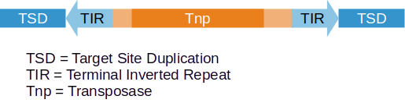

# TE-discovery
## Description
These scripts are a pipeline used to identify novel transposable element sequences from eukaryotic genomes that have the structure:
 

The innovation of these scripts, compared to alternative methods (e.g. RepeatModeler), is that they start with possible transposase sequences and then identify the signature structures of transposable, rather than being primarily on sequence homology (this allows completely new elements to be discovered), and that human review steps are incorporated into the pipeline to ensure high quality results. These scripts emphasize quality over quantity. While not all elements will be identified, even low copy number elements may be identified with high confidence.

The pipeline is run as a series of steps. Every step assumes that the previous step has been successfully executed first, but the steps do not all have to be executed on the same machine. The pipeline can be restarted using the output of the previous step on another computer. This allows the user some flexibility in optimizing the resources of the available machines to the computation requirements of individual steps.

### Steps  outline
The pipeline inputs 1) a DNA sequence of a genome, 2) a list of protein sequences from that genome that could potentially be transposases. This second file could be the sequences of identified proteins from that genome.

***STEP 1 Map proteins to the genome***

All the input proteins are mapped to the genome using tblastn. The resulting output is filtered out to remove proteins that have one or more the following features: 1) map to too few loci (a transposable element is expected to be repeated), 2) don't map with sufficient length and identify, 3) map only to single cluster with the genome (a transposable element is expected be found in somewhat dispersed loci). These steps are inspired from the transposable element discovery pipeline described by [Goubert et al. 2022](https://mobilednajournal.biomedcentral.com/articles/10.1186/s13100-021-00259-7).

***STEP 2 Scan around the proteins matches for TSD-TIR patterns***
Here, the genomic region surrounding each remaining tblastn hit is scanned for the signature structure of TSDs and TIRs. Input proteins that don't have detected TSD-TIR structures in many of their genomic copies are filtered from further analysis. 

***STEP 3 Manual review of potential transposable elements***
Grouped by the input protein sequences the TSD-TIR structure of the remaining sequences is reviewed by a human. The person determines 1) if the TSD-TIR junctions appear to be those of a genuine transposable element, 2) what the most likely length of TSDs and TIRs appears to be for the each potential transposable element. 

***STEP 4 Identification of nearly complete elements***

## Running the scripts

### Running the pipeline 

**Required of all steps**

The pipeline is written in Perl, and is executed from the command line using 

	perl mainscript.pl -n <analysis name> <other parameters>

Where:

	-n is the name of the current analysis. 

This name will be used as the base to create two folders called <analysis name>-element and <analysis name>-analysis. The folder ending in *-element* will include sub-folders for each idenfied element along with supporting information about it. The folder ending in *-analysis* will contain files with information about the analysis such as parameters, and rejeced elements.

Other step specific parameters will be required as well, see below.

**Specify which steps to execute**

Unless otherwise specified all the analysis steps above will be executed. To specify that just one or a range
of consecutive steps be executed the following parameter(s) can be set:

    -a number of first (or only) step to execute
    -b number of last step to execute, if not specified then only the first step will be executed

### Step specific parameters

***STEP 1 parameters*** 

The input file(s) for this step can be either a fasta file of proteins and an associated genome file, or a tblastn output file.
The tblastn option is available so that this time consuming tblastn analysis can be run on a separate machine (e.g. a computer cluster). If the tblastn is run on its own, the output file must be formatted in the same way as in the script. Specifically, the `tblastn` output parameter must be set to:

	-outfmt "6 qseqid sseqid sstart send pident length qlen"

**If STEP 1 uses a list of proteins as input** specify these parameters if the script should executed the tblastn:
 
	-p fasta formatted file of proteins 
	-g fasta formatted file genome file; this file must have been formatted with "makeblastdb" ahead of time

**If STEP 1 uses a tBLASTN file as input** specify this paramter if the tblastn has already been exectuted:
 
    -t tblastn output in the format specified above

***STEP 2 parameter and file requirement*** 

When running this step the `-g` parameter (described in STEP 1) must be specified. In addition, the script will expect a file to be present in the same directory as the genome file. This file must have the name of the genome file followed by `.length`. Each line in this file should contain a fasta title from the genome file and the length in nucleotides of the associated sequence. This `.length` file can be generated using the following BASH commands:

	samtools faidx <genome fasta formatted file name>
	awk '{OFS="\t"; print $1, $2}\' < <genome fasta formatted file name>.fai > <genome fasta formatted file name>.length
    
***STEP 3 has no step specific parameters or requirements*** 

## Understanding analysis output folders files

Each step will generate files that specify the outcome of the analysis. The goal of many of these files is to document exactly why each input protein was considered to be part of transposable element or not. There are two main folders produced by this pipeline. One, specified by the `-e` parameter, contains subfolders for every protein still considered to possibly be a part of transposable element. The second folder, specified by the `-n` parameter contains subfolders for all the protein sequences that were considered and rejected by the pipeline as being from transposable elements, as well as files specifying the analysis parameters used. Below the output files are described.

### README files
Every subfolder with an input protein name contains a `README.txt` file that reports the analyses performed on this element. It may contain the following information (depending how long it was considered a candidate for being a transposable element).

1) The number of genomic locations (loci) were found when matching the input protein to the genome using tblastn
2) The names of various files specific to this element (files described below)
3) A statement of how the element performed on the "edge test". A true transposable element is expected to have a sharp transition in the alignment between sequences outside the element and TSD-TIR sequences inside the element. If such a sharp transition is too close the edge of the extended element, the script assumes no such transition is present and the sequences are not considered to be from transposable elements.
4) A statement from the manual review in STEP 3, including notes from the reviewer.

### .bed files
The output of tblastn is converted to a .bed file

### .alipos files
These files are in a pipeline specific format, and contains information on element alignment locations removed because they are shared by too few copies of this element (this is the same proceedure as described in [Goubert et al. 2022](https://mobilednajournal.biomedcentral.com/articles/10.1186/s13100-021-00259-7). This file may be used to reconstruct the original alignment, prior to trimming the low copy alignment position.

### .maf files
These files that contains the multiple sequence alignment of all the extended blast matches (see STEP 2), but with alignment positions with too many gaps are removed (see .alipos file).  

### .tirtsd files 
This file is meant to be used along with the .maf file. This .tirtsd file specifies positions in the alignment that delimit the outside locations TIR positions (in the .tirtsd file these are `loc1` and `loc2`). Each line also specifies a success code (see below), the number of alignment sequences that have intact TIRs, and the number of intact TSDs (TSD categories are TA, 2bp., 3bp, ... , 10bp.).

### Analysis_parameters.txt file
This file contains a list of parameters used by the steps in the pipeline run. Most of these paramters can be modified directly in the perl script in subsequent analyses

### Rejected_sequences.txt file
A list of input protein sequences that are not considered to be transposable elements. The step number and reason why the element was rejected are specified.

### tblastn.o file
Output of the tblastn analysis

### Rejected_elements folder
This folder contains sub folders for all the input proteins that were not filtered in STEP 1, but were rejected subsequently as not being transposable elements.

## Success codes
The .tirtsd file includes a 4 digit success code that reports on TSD and TIR sequences in the alignment. The pipeline can be tailored to consider only certain success codes as being associated with true transposable elements. The README.txt file will report how many TIR-TSD combinations were rejected because they did not have an acceptable success code.

**first digit** is 1 if proportion of sequences with TIRs in the current multiple sequence alignment (the .maf file) higher than the proportion specified in the perl script by the $MIN_PROPORTION_SEQ_WITH_TIR variable. It is 0 otherwise.

**second digit** is 1 if the specific TIR is one of the most common ones in this alignment. It is 0 otherwise.

**third digit** is 1 if the first few, and last few, bases of the TIRs are generally the same between TIRs in this alignement. It is 0 otherwise.

**fourth digit** is 1 if the current TIR is associated with one of the highest number of identified TSDs in the alignment. It is 0 otherwise.

