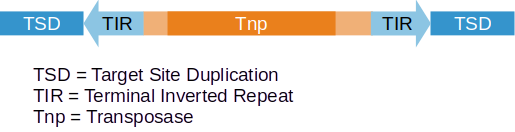

# Transposon Discovery
## Description
These scripts form a pipeline used to identify novel transposable element sequences from eukaryotic genomes that have the structure:
 

The innovations of these scripts, compared to alternative methods (e.g. RepeatModeler), is first that they start with user provided list of potential transposase sequences, such as the sequence of all the protein coding genes. The scripts then identify the signature structures of a transposon (see figure above) around these potential transposases. The advantage of this method over purely homology based methods is that transposons with no homology to known sequences could potentially be discovered this way. The second innovation is that these scripts integrate human review steps during the execution of the pipeline. This incorporation of human review maximizes the probability of high quality results at the end of the pipeline. As a result, identified transposons are described in detail and are very unlikely to be artefacts. However, this methodology will is unlikely to discover all elements present in the genome.

The pipeline is run as a series of steps. Every step assumes that the previous step has been successfully executed first, but the steps do not all have to be executed on the same machine. The pipeline can be restarted using the output of the previous step on another computer. This allows the user some flexibility in optimizing the resources of the available machines to the computation requirements of individual steps.

### Pipeline Overview
The pipeline inputs are: 1) a DNA sequence of a genome, 2) a list of protein sequences from that genome that could potentially be transposases. This second file could be the sequences of all identified proteins from that genome.

***STEP 1 Map proteins to the genome***

All the input proteins are mapped to the genome using [BLAST+ tblastn](https://pubmed.ncbi.nlm.nih.gov/20003500/). The resulting output is filtered to remove input amino acid sequences that have one or more the following features: 1) map to too few loci (ransposons are expected to occur at multiple loci), 2) don't map with sufficient length and identify, 3) map exclusively to the genomic neighberhood of a single locus in the genome (a transposon is expected be found in dispersed loci). These steps are inspired from the transposable element discovery pipeline described by [Goubert et al. 2022](https://mobilednajournal.biomedcentral.com/articles/10.1186/s13100-021-00259-7).

***STEP 2 Scan around the proteins matches for TSD-TIR patterns***
The genome region surrounding each remaining tblastn hit is scanned for the signature structure of TSDs and TIRs. Input amino acid sequences that don't show the signatures of TSD-TIR structures in engough of their genomic copies are filtered from further analysis.

***STEP 3 Manual review of TSD-TIR structure for potential transposable elements***
Grouped by the input amino acid sequences, the TSD-TIR structure of the remaining sequences is reviewed by a human. The person determines 1) if the TSD-TIR junctions appear to be those of a genuine transposable element, 2) what the most likely length of TSDs and TIRs appears to be for each potential transposon. 

***STEP 4 Clustering and preparing for transposase analysis***
Up to this point the pipeline has treated each input amino acid sequence as a different transposon, but of course this is often wrong, the same transposase may be found at multiple loci. In this step the output of STEP 3 are clustered by TIR sequences, rather than by transposase sequence. Clustering by TIR minimizes the chances that a single transposon will end up in two different clusters. After the clustering, the genomic sequences of all potential transposons are written to a single file as a FASTA formatted file.

***Evaluating transposase sequences***
This step is not performed by the pipeline, but rather by another specialized software suite. The genomic sequences from STEP 4 are examined using EMBL's [Interproscan](https://interproscan-docs.readthedocs.io). This will will identify possible ORFs and possible transpoase motifs, such as [DDE](https://pmc.ncbi.nlm.nih.gov/articles/PMC2991504/). 

***STEP 5 Human evaluation of the all evidence***
The human operator is presented will all the collected evidence on TSD, TIR, and transposase for each cluster identified in STEP 4. The human makes a final determination if it appears to be a genuine transposon.

## Running the pipeline 

**Requirements for All Steps**

The pipeline is written in Perl, and is executed from the command line using 

	perl mainscript.pl -n <analysis name>  -s <step(s) to execute> <other parameters>

Where:

	-n is the name of the current analysis
	-s is one of the steps to execute (step 12 can be used to execute both steps 1 and 2 consecutively)

This name specified by the -n parameter can be any string, and will be used to identify this analysis from any others. The pipeline will assume that it is always excuted from the same location in the filesystem. If the Perl script is executed from two different folders between steps, an error will be thrown that expected folders cannot be found. A number of folders will be created by the pipeline during the execution at various stages. These include:

1. a folder called <analysis name>-element: this will contain sub-folders for each input amino acid sequence.
2. a folder called  <analysis name>-analysis: this contain files and subfolders with information about the analysis such as parameters, detailed pipeline output, and rejeced elements.
3. a folder called  <analysis name>-clusters: contains a subfolder for each cluster of sequences from the <analysis name>-element folder.

Other folders may also be created.

### Step specific parameters

***STEP 1 parameters*** 

The input file(s) for this step can be either a fasta file of amino acid sequences and an associated genome file, or a tblastn output file.
The tblastn option is available so that this time consuming tblastn analysis can be run on a separate machine (e.g. a computer cluster). If the tblastn is run on its own, the output file must be formatted in the same way as in the script. Specifically, the `tblastn` output parameter must be set to:

	-outfmt "6 qseqid sseqid sstart send pident length qlen"

**If STEP 1 uses a FASTA formated list of amino acid sequences as input** use the parameters if the script is to excute the tblastn search:
 
	-p fasta formatted file of amino acid sequences 
	-g fasta formatted file genome file; this file must have been formatted with "makeblastdb" ahead of time

**If STEP 1 uses a tBLASTN file as input** specify this paramter if the tblastn has already been executed:
 
    -t tblastn output in the format specified above

***STEP 2 parameter and file requirement*** 

When running this step the `-g` parameter (described in STEP 1) must be specified. In addition, the script will expect a file ending `.length` that specifies the length in nucleotides of all genome sequences. This is a requirement of the [samtools](https://www.htslib.org/doc/) software used by this step. This `.length` file can be generated using the following commands lines:

	samtools faidx <genome fasta formatted file name>
	awk '{OFS="\t"; print $1, $2}\' < <genome fasta formatted file name>.fai > <genome fasta formatted file name>.length
    
***STEP 3 has no step specific parameters or requirements*** 

***STEP 4 parameter and file requirement*** 

	-g fasta formatted file genome file; this file must have been formatted with "makeblastdb" ahead of time

***STEP 5 parameter and file requirement*** 

	-in interproscan output in GFF format; the output of the interproscan run, the file should be format in the GFF formt

## Understanding analysis output folders files

Each step will generate files that specify the outcome of the analysis. The goal of many of these files is to document why each input amino acid sequence was considered to be part of transposon or not. Within the folder *<analysis name from -n parameter>-analysis* is a file called *Analysis_run_and_parameters.txt* the logs the progress of the analysis. In that same folder the file *Rejected_sequences.txt* records sequences that were excluded in STEP 1 and STEP 2 and the reasons why.

### README files (in -element subfolder)
Every subfolder with an input protein name contains a `<sequence name>-README.txt` file that reports the analyses performed based on the input amino acid sequence. It may contain the following information (depending how far it progressed through the pipeline).

1) The number of genomic locations (loci) were found when matching the input protein to the genome using tblastn
2) The names of various files specific to this element (files described below)
3) A statement of how the element performed on the "edge test". A true transposable element is expected to have a sharp transition in the multiple sequence alignment, between sequences outside the element and TSD-TIR sequences inside the element. If such a sharp transition is too close the edge of the alignment the script assumes no such transition is present and the sequences are not considered to be from transposable elements.
4) A statement from the manual review in STEP 3, including notes from the reviewer.

### .bed files (in -element subfolder)
The output of tblastn is converted to a .bed file

### .maf files (in -element subfolder)
These files that contains the multiple sequence alignment of all the extended blast matches (see STEP 2), but with alignment positions with too many gaps are removed.  

### .tirtsd files (in -element subfolder)
This file is meant to be used along with the .maf file. This .tirtsd file specifies positions in the alignment that delimit the outside locations of TIR positions (in the .tirtsd file these are `loc1` and `loc2`). Each line also specifies a success code (see below), the number of alignment sequences that have intact TIRs, and the number of intact TSDs (TSD categories are TA, 2bp., 3bp, ... , 10bp.).

### Analysis_parameters.txt file (in -analysis subolder)
This file contains a list of parameters used by the steps in the pipeline run. Most of these paramters can be modified directly in the perl script in subsequent analyses

### Rejected_sequences.txt file (in -analysis subolder)
A list of input protein sequences that are not considered to be transposable elements. The step number and reason why the element was rejected are specified.

### tblastn.o file (in -analysis subolder)
Output of the tblastn analysis

### Rejected_elements folder (in -analysis subolder)
This folder contains sub folders for all the input proteins that were not filtered in STEP 1, but were rejected subsequently as not being transposable elements.

## Success codes
The .tirtsd file includes a 4 digit success code that reports on TSD and TIR sequences in the alignment. The pipeline can be tailored to consider only certain success codes as being associated with true transposable elements. The README.txt file will report how many TIR-TSD combinations were rejected because they did not have an acceptable success code.

**first digit** is 1 if the proportion of sequences with TIRs in the current multiple sequence alignment (the .maf file) higher than the proportion specified in the perl script by the $MIN_PROPORTION_SEQ_WITH_TIR variable. It is 0 otherwise.

**second digit** is 1 if the specific TIR is one of the most common ones in this alignment. It is 0 otherwise.

**third digit** is 1 if the first few and last few, bases of the TIRs are (almost) the same between TIRs in this alignment. It is 0 otherwise.

**fourth digit** is 1 if the current TIR is associated with one of the highest number of identified TSDs in the alignment. It is 0 otherwise.

