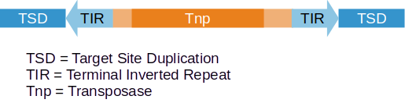

# Transposon Discovery
## Description
These scripts form a pipeline used to identify novel transposable element sequences from eukaryotic genomes that have the structure:
 

The innovation of these scripts compared to alternative methods (e.g. RepeatModeler), is that rather than partially identifying all the transposable elements in a genome, these script assist in doing a more in-depth search and produce much more complete transposable ements seqeunces (i.e. including TSD, TIR, and Transposase, sequences shown in the figure above). This can be acheive because 1) the scripts their search on a more limited starting set of sequences than the entire nucleotide genome, 2) these scripts are not fully automated, they depend on an active interaction between the scripts and the human user at multiple steps in the analysis pipeline. This interaction between script and human minimizes the chances that the scripts will missidentify non-transposable element sequences.
What this pipeline does is to start with a set of translated sequences that could potentially be transposase proteins. This set need not be too specific, for example all the identified proteins sequence from a genome sequencing project could bea starting set. The pipeline then maps each of these proteins to the genome. Since a transposase protein would be expected to match to more than one locus in the genome, the pipeline will focus on those proteins that map to mulitple locations. Finally, the pipeline does extensive searching in the nucleotide genome surrounding selected mapped loci, looking for the signature structures of a transposon (see figure above). The advantage of this method over purely homology based methods is that transposons with no homology to known sequences could potentially be discovered this way. Furthermore, the incorporation of human reviews maximizes the probability of high quality results at the end of the pipeline producing a detailed and likely accurate picture of existing transposable elements. However, a downside of this methodology is that it is unlikely to discover *all* the transposalbe elements present in the genome. Therefore, this pipeline should be treated as a complement, rather than a replacement, for other methods.

The pipeline is run as a series of steps. Every step assumes that the previous step has been successfully executed first, but the steps do not all have to be executed on the same machine. The output of each step is written to files the next step can use. This allows the pipeline to have individual steps run on diffrent machine, giving the user some flexibility in optimizing the resources of the available machines to the computation requirements of individual steps.

### Pipeline Overview
The pipeline inputs are: 1) a genome DNA sequence, 2) a list of protein sequences from that genome that could potentially be transposases.

***STEP 1 Map proteins to the genome***

All the input proteins are mapped to the genome using [BLAST+ tblastn](https://pubmed.ncbi.nlm.nih.gov/20003500/). The resulting output is filtered to remove input amino acid sequences that have one or more the following features: 1) map to too few loci (transposons are expected to occur at multiple loci), 2) don't map with sufficient length and identity, 3) map exclusively to the genomic neighberhood of a single locus in the genome (a transposon is expected be found in dispersed loci). These steps are inspired from the transposable element discovery pipeline described by [Goubert et al. 2022](https://mobilednajournal.biomedcentral.com/articles/10.1186/s13100-021-00259-7).

***STEP 2 Scan around the proteins matches for TSD-TIR patterns***
The genome region surrounding each of the tblastn hits (after filtering by STEP 1) is scanned for the signature structure of TSDs and TIRs. Input sequences sequences that don't show the signatures of TSD-TIR structures in engough of their genomic copies are filtered away from further analysis.

***STEP 3 Manual review of TSD-TIR structure for potential transposable elements***
Grouped by the input protein sequences, the TSD-TIR structure of the remaining sequences is reviewed by the human user. The user determines: 1) if the TSD-TIR junctions appear to be those of a genuine transposable element, 2) what the most likely length of TSDs and TIRs appears to be for each potential transposon. 

***STEP 4 Clustering and preparing for transposase analysis***
Up to this point the pipeline has treated each input protein sequence as a different transposon, but of course this is often wrong since the same transposase may be found at multiple loci. In this step the output of STEP 3 is clustered by TIR sequences, rather than by transposase sequence. Clustering by TIR minimizes the chances that a single transposon will end up in two different clusters. After clustering, the genomic sequences of all potential transposons are written to a single file as a FASTA formatted file.

***Evaluating transposase sequences***
This step is not performed by the pipeline, but rather by another specialized software suite. The genomic sequences from STEP 4 are examined using EMBL's [Interproscan](https://interproscan-docs.readthedocs.io). This will will identify possible ORFs and possible transpoase motifs, such as [DDE](https://pmc.ncbi.nlm.nih.gov/articles/PMC2991504/). 

***STEP 5 Combining all evidence in human readable form***
The data from the clusters in STEP 4 is combined with evidence from Interproscan, aligned and presented in a human readable from for the user to evaluate. 

***Human review of the pipeline data***
Based on the output of STEP 5, the user makes the final call of the most likely sequence of the original transposable element sequences that gave rise to all the partial sequences observed in the genome.

## Running the pipeline 
**Prerequisites**
The scripts are written in Perl, and require a number of libraries to be installed (using CPAN for example), details of the required libraries can be found at the head of the file *mainscript.pl*. 
In addition to this, the script will call on a number of external programs that should be installed and put into the path of the directory where the Perl script is executed. These external programs in include:
- [cd-hit](https://github.com/weizhongli/cdhit/blob/master/doc/cdhit-user-guide.wiki)
- [NCBI-BLAST+](https://blast.ncbi.nlm.nih.gov/doc/blast-help/downloadblastdata.html)
- [bedtools](https://github.com/arq5x/bedtools2)
- [samtools](https://www.htslib.org/doc/)
- [mafft](https://mafft.cbrc.jp/alignment/software/)
- [aliview](https://ormbunkar.se/aliview/)
- [gnome-text-editor](https://apps.gnome.org/TextEditor/)

**Requirements for All Steps**

The pipeline is written in Perl, and is executed from the command line using 

	perl mainscript.pl -n <analysis name>  -s <step(s) to execute> <other parameters>

Where:

	-n is the name of the current analysis 
	-s is one of the steps to execute (step 12 can be used to execute both steps 1 and 2 consecutively)

This name specified by the -n parameter can be any non-whitespace string, and will be used to identify s particular run of the pipeline. A number of folders will be created by the pipeline during the execution at various stages. These include:

1. a folder called <analysis name>-element: this will contain sub-folders for each input protein sequence that makes it through filters in STEPS 1 and 2.
2. a folder called  <analysis name>-analysis: this contain files and subfolders with information about the analysis such as parameters, detailed pipeline output, and rejeced elements (i.e. analysis of input proteins that did not pass the filters in STEPS 1 and 2), as well as intermediary sequences no longer used by the pipeline.
3. a folder called  <analysis name>-clusters: contains a subfolder for each cluster of sequences from the <analysis name>-element folder, this will be generated in STEP 4.

Other folders may also be created, some of them as subfolders of the ones above, the data in those subfolders is explained below.

### Step specific parameters

***STEP 1 parameters*** 

The input file(s) for this step can be either a fasta file of protein sequences and an associated genome file, or a tblastn output file. The tblastn option is available so that this time consuming tblastn analysis can be run on a separate machine (e.g. a computer cluster). If the tblastn is run prior to this step, the output file must be formatted in the same way as in the script. Specifically, the `tblastn` output parameter must be set to:

	-outfmt "6 qseqid sseqid sstart send pident length qlen"

**If STEP 1 uses a FASTA formated list of protein sequences as input** use the parameters use the input parameters below:
 
	-p fasta formatted file of protein sequences 
	-g fasta formatted file genome file; this file must have been formatted with NCBI's makeblastdb ahead of time

**If STEP 1 uses a tBLASTN file as input** specify this paramter if the tblastn has already been executed:
 
    -t tblastn output in the format specified above

***STEP 2 parameter and file requirement*** 

When running this step the `-g` parameter (described in STEP 1) must be specified. In addition, the script will expect a file ending `.length` that specifies the length in nucleotides of all genome sequences. This is a requirement of the [samtools](https://www.htslib.org/doc/) software used by this step. This `.length` file can be generated using the following commands lines:

	samtools faidx <genome fasta formatted file name>
	awk '{OFS="\t"; print $1, $2}\' < <genome fasta formatted file name>.fai > <genome fasta formatted file name>.length
    
***STEP 3 has no step specific parameters or requirements*** 

***STEP 4 parameter and file requirement*** 

	-g fasta formatted file genome file; this file must have been formatted with NCBI's makeblastdb ahead of time

***running Evaluating transposes sequences***

This step is run using EMBL-EBI's [Interproscan](https://www.ebi.ac.uk/interpro/about/interproscan/) software from the command line. Once installed locally the program is run using the following command line:

	interproscan.sh -i ./<analysis name>-clusters/<analysis name>-combined-clusters-nucleotide-sequences.fa -appl Pfam,Panther -t n -f GFF3 -o <analysis name>-Interpro.gff3 

In STEP 4 a file called <analysis name>-combined-clusters-nucleotide-sequences.fa will be created in the folder <analysis name>-clusters. This file contains all the nucleotide sequences that should be evaluated for the presense of open reading frames. A single file is created for all the clusters to speed up this analysis. The output of the interproscan.sh run will be a single gff3 formatted file that contains identified ORFs, as well as protein domains matching the Pfam and PANTHER databases. 

***STEP 5 parameter and file requirement*** 

	-in interproscan output in GFF format; the output of the interproscan run, the file should be in the GFF format 

## Understanding analysis output folders files

Each step will generate files that specify the outcome of the analysis. The goal of many of these files is to document why each input protein sequence was considered to be part of transposable element or not. Within the folder *<analysis name>-analysis* is a file called *Analysis_run_and_parameters.txt* that logs the progress of the analysis at each step. In that same folder the file *Rejected_sequences.txt* records sequences that were excluded in STEP 1 and STEP 2 and the reasons why.

### README files (in -element subfolder)
Every subfolder in both the *-element* folder contains a `<sequence name>-README.txt` file that reports the analyses performed based on the input protein sequences. It may contain the following information (depending how far it progressed through the pipeline). Note that this folder is moved to the *<analysis name>-analysis* folder at the end of STEP 4, all the analysis from then on is done on the *<analysis name>-clusters* folder.

1) The number of genomic locations (loci) were found when matching the input protein to the genome using tblastn
2) The names of various files specific to this element (files described below)
3) A statement of how the element performed on the "edge test". A true transposable element is expected to have a sharp transition in the multiple sequence alignment, between sequences outside the element and TSD-TIR sequences inside the element. If such a sharp transition is too close the edge of the alignment the script assumes no such transition is present and the sequences are not considered to be from transposable elements.
4) A statement from the manual review in STEP 3, including notes from the reviewer.

### .bed files (in -element subfolder)
The output of tblastn is converted to a .bed file

### .maf files (in -element subfolder)
These files that contains the multiple sequence alignment of all the extended blast matches (see STEP 2), but with alignment positions with too many gaps are removed.  

### .tirtsd files (in -element subfolder)
This file is meant to be used along with the .maf file. This .tirtsd file specifies positions in the alignment that delimit the outside locations of TIR positions (in the .tirtsd file these are `loc1` and `loc2`). Each line also specifies a success code (see below), the number of alignment sequences that have intact TIRs, and the number of intact TSDs (TSD categories are TA, 2bp., 3bp, ... , 10bp.).

#### Success codes
The .tirtsd file includes a 4 digit success code that reports on TSD and TIR sequences in the alignment. The pipeline can be tailored to consider only certain success codes as being associated with true transposable elements. The README.txt file will report how many TIR-TSD combinations were rejected because they did not have an acceptable success code.

**first digit** is 1 if the proportion of sequences with TIRs in the current multiple sequence alignment (the .maf file) higher than the proportion specified in the perl script by the $MIN_PROPORTION_SEQ_WITH_TIR variable. It is 0 otherwise.

**second digit** is 1 if the specific TIR is one of the most common ones in this alignment. It is 0 otherwise.

**third digit** is 1 if the first few and last few, bases of the TIRs are (almost) the same between TIRs in this alignment. It is 0 otherwise.

**fourth digit** is 1 if the current TIR is associated with one of the highest number of identified TSDs in the alignment. It is 0 otherwise.

### Analysis_run_and_parameters.txt file (in -analysis subolder)
This file contains a list of parameters used by the steps in the pipeline run. Most of these paramters can be modified directly in the perl script in subsequent analyses

### Rejected_sequences.txt file (in -analysis subolder)
A list of input protein sequences that are not considered to be transposable elements. The step number and reason why the element was rejected are specified.

### tblastn.o file (in -analysis subolder)
Output of the tblastn analysis

### Rejected_elements folder (in -analysis subolder)
This folder contains sub folders for all the input proteins that were not filtered in STEP 1, but were rejected subsequently as not being transposable elements.

### README files (in -clusters subfolder)
Similar to the README files in the *<analysis name>-analysis*folder, but this contains information specific to the cluster analysis (i.e. after STEP 4).

1) Which elements from the *<analysis name>-analysis* folder were combined to create this cluster. Note that a single element can be used to make a cluster
2) A statement regarding the orientation of the nucleotide sequence. Prior to the identification of ORFs the nucleotide sequences are aligned in the same orientation, but it cannot be determined if it's in the positive or negative orientation. If ORFs are identified then the orientation can be determined.
3) The output of STEP5 uses a two letter code to identify where PANTHER and Pfam domains were found on the protein alignment, the README file contain a key to these codes that includes a short description of the domain

### cluster\<number\>.fa (in -clusters subfolder)
Includes all the sequence that have been determined to belong to the same cluster in STEP 4. The sequences are not aligned but they are all oriented in the same direction using *mafft --adjustdirection*. Later, if open reading frames are identified, they may all be reversed so the open reading frame is on the + strand.

### cluster\<number\>-aligned-nucleotides.fa (in -clusters subfolder)
This is the aligned version the sequences in cluster<number>.fa but not including any overlaping sequences. If ORFs are found the sequences are oriented based on the majority of open reading frames. Sequences are divided into sequence with and without open reading frames.

### cluster\<number\>-aligned-aa.fa (in -clusters subfolder)
Aligned open reading frames of the sequences in cluster<number>-aligned-nucleotides.fa. They are in the same order between the two files. Furthermore, this file includes two letter codes indicating where either Pfam or PANTHER annotations were indentified during the Interproscan step. A key to these two letter codes is found in the README.txt file in the same folder. 

### cluster\<number\>-overlapping_sequences.fa (in -clusters subfolder)
Groups of sequences that were identified in STEP 5 as overalping each other. These sequences are not present in any of the other files in this subfolder.

## A detailed description of the mechanics
Below is a more mechanistic description of the scripts and what they do, most useful for people who are trying to understand how the script functions in detail. It's a guide to the source code.

### STEP 3
In this step the user interacts with the script to decide on the bounds of each transposable element, as well as the most likely TIR and TSD sequences. As the user interacts with the script the user's decisions are recorded in the *README.txt* file associated with an element. Every time the user is ready to ready to review a new element, all the *README.txt* files are scanned to determine which ones still need to be reviwed. This way the user can stop and restart their analysis any time they choose. 
Each time an element is determined to require a review, it is first checked to see if a the TSD and TIRs of the current element have already been identified previously. This will happen when the same transposable element is identified by two separate intial proteins. If this is case the sequences are annotated automatically without requiring user review, this saves time for the user.
If the element requires a user review (a.k.a. a manual review) the user is presented with a series of menus on the command line using the Term::Prompt library. The script checks 

### STEP 4 
In STEP 3 the user identified TIR sequences, in this step those TIR sequence are read and sequences are clustered by TIR sequences using *cd-hit-est*. Next, for each cluster the genomic sequence of each sequence is extracted from the genome and the resulting sequences oriented in the same direction using *mafft --adjustdirection*. For the moment it's not yet clear if the sequences are oriented in the 5' to 3' orientation of the transposase, but that will be determined in STEP 5 once the ORFs are identified. This step creates the *<analysis name>-clusters* folder.

### STEP 5
#### Overlapping sequences
The file *<analysis name>-combined-clusters-nucleotide-sequences.fa* that was created in STEP 4 may include overlapping sequences, in this context it means that identified sequences ending in TIRs and TSDs overlap with another sequence in the same cluster. These may be the result of transposable elements inserting into copies of themselves for example. How to merge these is not automatically clear, so it's left to the user to make that call. The first part of STEP5 is it to identify these sequences so they can be presented to the user as a separate group.
The mechanics here are to first to create a *.bed* file with the start and end positions of every sequence accross all clusters, then use *bedtools intersect* to identify overlaping sequences. Because there are many possible combinations of pairs to compare, the Perl library "Graph" is used to efficiently create a graph of overlapping pairs. This graph is then filtered to only report sequences overlapping withing the same cluster. Any overlaping sequences within a cluster are written to a separate file (cluster\<number\>-overlapping_sequences.fa) for the user to merge an perhaps reintegrate into the rest of the analysis.
#### Parsing the Interproscan output file
The Interpro output file is read, and the following information is recorded: 1) the genomic location of any identified open reading frames, 2) the unique ORF number for each open reading fram assigned by Interpropscan, 3) the location within the identified open reading frams of Pfam and PANTHER annotations. Only for the PANTHER annotations, the script also fetches a short description of each annotation. This is unecessary for Pfam, the short description is part of the Interproscan output file,
#### Aligning the nucleotide sequences and deciding on the orientation
All the nucleotide sequences are aligned using *mafft*. Following this the orientation of open reading frames in this cluster are evaluted, and the whole alignment is either reversed complemented or kept as-is, based on the orientation of the open reading frames. This works because the input sequences had all be put in the same orientation using the *mafft --adjustdirection* option, so they may all be assumed to be in the same direction to begin with. Finally the oriented, ordered, and non-overalapping sequences are written to the cluster\<number\>-aligned-nucleotides.fa file.
#### Aligning the protein sequences along with Pfam and PANTHER annotations
For each sequence with an open reading frame new "dummy" sequences are created with Pfam and PANTHER two letter codes. These dummy sequences have the same length a open reading frame amino acid sequences, but have either a "-" or the two letter code at the positions where Pfam or PANTHER annotations were identified.
The protein sequence are then aligned, and the dummy sequences are adjust to match all the gaps inserted by the alignment. The whole is then written to the file cluster\<number\>-aligned-aa.fa.
